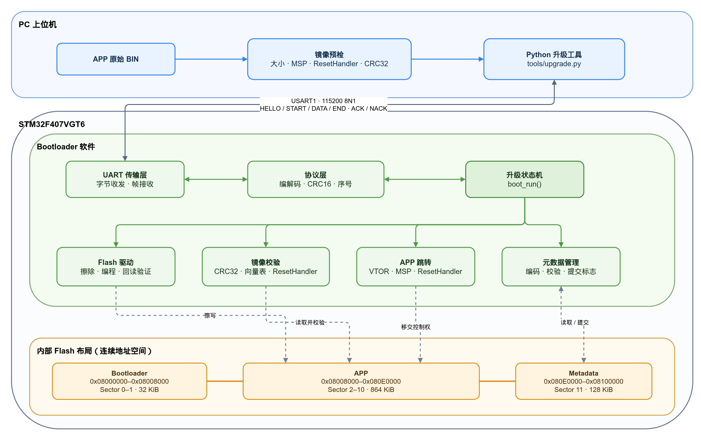
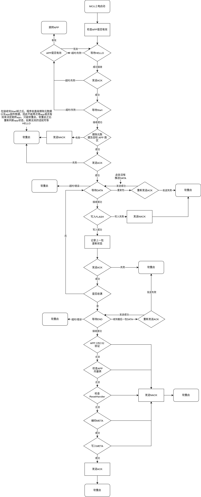
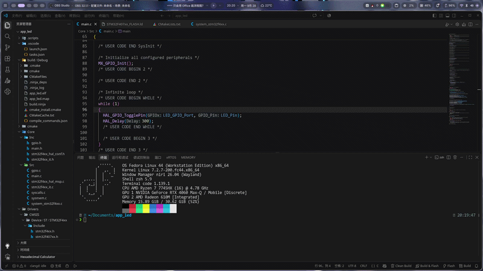
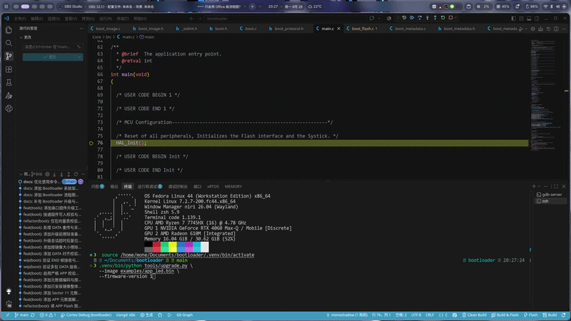
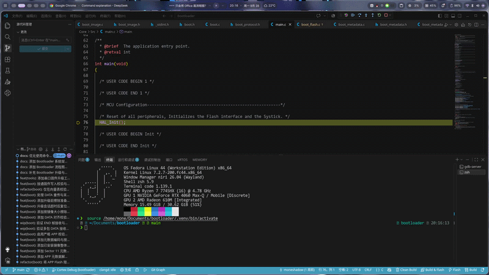

# STM32F407 UART Bootloader

本项目是 STM32F407VGT6 的 Bootloader 工程。Bootloader 和应用程序（APP）是**两个独立工程、分别链接**，但最终位于同一片内部 Flash：Bootloader 从 `0x08000000` 启动，APP 从 `0x08008000` 启动。Bootloader 通过 USART1 接收新 APP，校验后写入元数据并复位；没有升级请求且已安装的 APP 有效时，跳转到 APP。

当前为单 APP 分区方案。升级过程中旧 APP 会被擦除，**没有 A/B 双镜像回滚能力**。首次安装 Bootloader 仍需 ST-Link/SWD；日常 APP 更新可使用本仓库的 PC 串口脚本。

主要代码入口：`Core/Src/main.c` 调用 `boot/boot.c` 的升级状态机；`boot/boot_protocol.c` 负责编解码帧，`boot/transport/` 负责 UART 收发，`boot/boot_flash.c` 负责擦写，`boot/boot_metadata.c` 和 `boot/boot_image.c` 负责启动前校验，`boot/boot_jump.c` 负责交接到 APP。PC 工具位于 `tools/upgrade.py`，对应协议测试位于 `tests/test_upgrade_protocol.py`。

## 系统架构

下图展示 PC 升级工具、Bootloader 软件模块与 MCU 内部 Flash 分区之间的静态关系；具体的上电判断和升级时序见下一节的流程图。

<p align="center">
  
</p>

- [系统架构图 Draw.io 可编辑源文件](assets/bootloader-architecture.drawio)

## Bootloader 流程

下图展示 Bootloader 从上电检查 APP、等待升级，到校验镜像、提交元数据并复位的主流程。

<p align="center">
  
</p>

更详细的函数内部流程和调用关系：

- [Bootloader 实现流程总览](assets/bootloader-implementation-map.png)
- [Draw.io 可编辑源文件](assets/bootloader-flow.drawio)

## 硬件与 Flash 分区

USART1 使用 `115200 8N1`，PA9 为板端 TX、PA10 为板端 RX。使用 **3.3 V TTL** 串口，USB-UART 的 TX 接 PA10、RX 接 PA9，并共地；不要把 RS-232 电平直接接到 MCU。下面的 `/dev/ttyUSB0` 只是 Linux 示例，实际端口以本机为准。运行脚本前关闭其他占用该端口的串口工具。

所有结束地址均**不包含**在对应分区内：

| 用途 | 地址范围 | 容量 | STM32F407 扇区 |
| --- | --- | ---: | --- |
| Bootloader | `[0x08000000, 0x08008000)` | 32 KiB | Sector 0–1 |
| APP | `[0x08008000, 0x080E0000)` | 864 KiB | Sector 2–10 |
| 元数据 | `[0x080E0000, 0x08100000)` | 128 KiB | Sector 11 |

分区定义见 `STM32F407xx_FLASH.ld` 和 `boot/boot_memory.h`。APP 工程的链接脚本必须使用 `FLASH ORIGIN = 0x08008000, LENGTH = 864K`；APP 的向量表也必须定位到 `0x08008000`（当前 APP 工程使用 `USER_VECT_TAB_ADDRESS` 和 `VECT_TAB_OFFSET=0x00008000U`）。修改链接脚本后要重新链接；CMake 应将 `.ld` 加入目标的 `LINK_DEPENDS`。

元数据只使用 Sector 11 起始的 28 字节，字段均为小端序 32 位整数：

| 偏移 | 字段 | 说明 |
| ---: | --- | --- |
| 0 | `magic` | `0x474D4942`（Flash 中的字节为 `BIMG`） |
| 4 | `format_version` | 当前为 `1` |
| 8 | `image_size` | BIN 的实际字节数，不含最后一个 Flash Word 的填充 |
| 12 | `image_crc32` | 对实际 BIN 字节计算的 CRC32/IEEE |
| 16 | `firmware_version` | 由 PC 端指定；当前只记录，不强制递增或防降级 |
| 20 | `metadata_crc32` | 对前 20 字节计算的 CRC32/IEEE |
| 24 | `commit_marker` | `0xC0DEC0DE`；最后写入 |

启动时，Bootloader 检查元数据、APP 向量表、ResetHandler 是否位于镜像内，以及 APP CRC32。没有有效元数据时，即使 APP 区已有部分代码，也**不会跳转**到它。

## 升级协议

线上的帧格式为：

```text
A5 5A | VERSION | COMMAND | SEQUENCE | LENGTH | PAYLOAD | CRC16
  2B  |    1B   |    1B   |    2B    |   2B   | 0..256B |  2B
```

`VERSION=0x01`；`SEQUENCE`、`LENGTH` 和帧尾 CRC16 均为小端序。CRC16 使用 CCITT-FALSE（初值 `0xFFFF`、多项式 `0x1021`），计算范围是 `VERSION` 到 `PAYLOAD`，不包含帧头和 CRC 字段。最短帧 10 字节，最长 266 字节。

| 命令 | 值 | 序号与 Payload |
| --- | ---: | --- |
| HELLO | `0x01` | 序号 0，无 Payload |
| START | `0x02` | 序号 1；依次是 `image_size`、`image_crc32`、`firmware_version`，各 4 字节小端序 |
| DATA | `0x03` | 从序号 2 开始递增；1–256 字节。除最后一包外，长度须为 4 的倍数 |
| END | `0x04` | 最后一包 DATA 的序号加 1，无 Payload |
| ACK | `0x80` | 序号与请求一致；Payload 为被确认的命令值（1 字节） |
| NACK | `0x81` | 序号与请求一致；Payload 为被拒绝的命令值、原因码（各 1 字节） |

常见 NACK 原因：`0x03` 长度错误、`0x05` 序号错误、`0x06` 当前状态不接受该命令、`0x07` Flash 错误、`0x08` 镜像错误。完整定义见 `boot/boot_protocol.h`。

正常顺序是 `HELLO → START → DATA... → END`，每步等待对应 ACK。收到有效 START 后，板端**先擦除元数据和目标 APP 扇区，再回复 START ACK**。DATA 按序写入并回读验证；丢失 DATA ACK 时，PC 可以原样重发同一序号和内容，板端识别重复包后重发 ACK，不重复推进写入进度。END 阶段校验完整镜像 CRC32 和向量表，成功后写入元数据、发送 END ACK 并软复位。

未收到 HELLO 且原 APP 有效时，Bootloader 启动等待约 1 秒后跳转；HELLO 已确认但没有 START 时，约 5 秒后跳转原 APP。进入 DATA/END 阶段后，若等待超时则复位；因为元数据已擦除，不能把未完成镜像作为有效 APP 启动。

## 构建与使用 PC 脚本

需要 CMake、Ninja、`arm-none-eabi` 工具链、Python 3.10+，以及真实串口操作所需的 `pyserial`。除非特别说明，下面的命令都从本仓库根目录执行，因此不依赖仓库在电脑上的具体位置。仅运行协议单元测试或本地 BIN 检查，不需要 `pyserial`。

```bash
cmake --preset Debug
cmake --build --preset Debug
python3 -m venv .venv
.venv/bin/python -m pip install pyserial
```

仓库中的 `examples/app_led.bin` 是供测试升级链路使用的示例固件：目标芯片为 STM32F407VGT6，链接地址为 `0x08008000`，运行后每秒翻转一次 PB2。该文件大小为 6000 字节，CRC32/IEEE 为 `0x7B454728`，可以直接用于下面的预检和实板升级命令。

若要升级自己的 APP，需要先在独立的 APP 工程中构建，再把 ELF 转成**原始 BIN**。不要把 ELF 文件直接交给升级脚本。下面假设 APP 工程与本仓库位于同一父目录；如果不是，只需修改 `APP_BUILD_DIR`：

```bash
APP_BUILD_DIR=../app_led/build/Debug
cmake --build "$APP_BUILD_DIR"
arm-none-eabi-objcopy -O binary \
  "$APP_BUILD_DIR/app_led.elf" \
  "$APP_BUILD_DIR/app_led.bin"
```

在本仓库根目录运行以下命令。先做不接触板子的本地预检，脚本会检查大小、初始 MSP、Thumb 位、ResetHandler 范围并计算 CRC32：

```bash
.venv/bin/python tools/upgrade.py \
  --image examples/app_led.bin \
  --firmware-version 1
```

只检查串口 HELLO/ACK，不擦写 Flash：

```bash
.venv/bin/python tools/upgrade.py --port /dev/ttyUSB0
```

**真正升级**必须显式加 `--upgrade`。当前 APP 有效时，启动命令后在提示的等待时间内复位板子；若元数据已失效，Bootloader 会持续等待 HELLO，通常无需再按 Reset。需要更长的复位窗口可加 `--wait 30`（默认 10 秒）。

```bash
.venv/bin/python tools/upgrade.py \
  --port /dev/ttyUSB0 \
  --image examples/app_led.bin \
  --firmware-version 1 \
  --upgrade
```

脚本在启动串口前做镜像预检。它会反复发送 HELLO 直到收到匹配 ACK；START 和 END 超时不自动重发，只有 DATA 超时会原包重试。脚本输出“收到 END ACK”表示板端报告升级完成，**不等于 PC 已独立回读 Flash**；需要更高把握时可再通过 ST-Link 比对 APP 和元数据。版本号当前没有防降级语义，发布新版本时应由操作者明确选择。

协议单元测试：

```bash
python3 -m unittest discover -s tests -p 'test_upgrade_protocol.py' -v
```

## 操作演示

### elf转bin

<p align="center">
  
</p>

### 下载升级来自其他位置的bin

<p align="center">
  
</p>

### 升级调试

<p align="center">
  
</p>

## 失败与恢复

| 现象 | 板端状态和处理方式 |
| --- | --- |
| HELLO 超时 | 尚未发送 START，不会因本次尝试擦写 APP。检查串口、TX/RX 交叉接线、共地和复位时机后重试。 |
| START ACK 超时 | **结果不确定**：板端可能已擦除 APP，只是 ACK 丢失。不要假定旧 APP 仍可运行，也不要接着发送 DATA；重新复位并从 HELLO 开始完整升级。 |
| DATA 反复超时或收到 NACK | 元数据可能已经擦除，本次升级未完成。排查通信/Flash 错误后复位，从完整 BIN 重新升级；不要只补发剩余部分。 |
| END 返回 `IMAGE_ERROR (0x08)` | 完整数据未通过 CRC32 或向量表检查，元数据不会提交。检查 BIN 与 START 信息，再从头升级。 |
| END ACK 超时 | **结果不确定**：板端可能已提交并复位，不能据此判定失败，也不要盲目重发 END。先观察 APP、必要时用 ST-Link 回读确认；确属无效镜像再从头升级。 |

当前 Bootloader 不支持“断点续传”、远程查询升级状态、镜像签名验证或 A/B 回滚。START 已被接受后发生断电/中断时，保留 Bootloader，通过完整重传恢复；不要尝试跳过 HELLO/START 继续发送 DATA。

## 已验证场景

在 STM32F407VGT6 实板上，使用 6000 字节的 `app_led.bin`（CRC32 `0x7B454728`、版本 1）验证过：正常串口升级并复位运行 APP；首包 DATA 后中断，元数据保持擦除态并可从头恢复；故意声明错误的 CRC32，END 返回 `IMAGE_ERROR` 且不提交元数据，随后正常升级恢复。恢复后用 ST-Link 逐字节比对 APP、检查元数据，并确认点灯现象正常。
